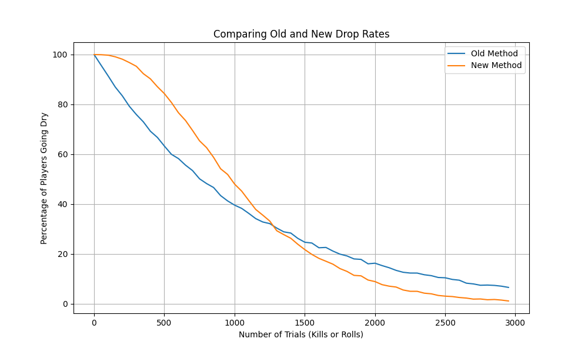
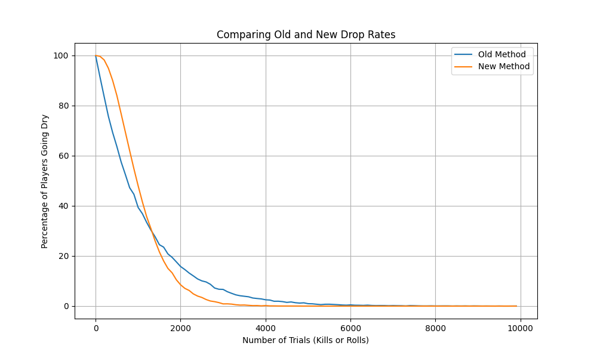

# Drop Rate Simulations
## Introduction

This is a short project to simulate the likelihood of an item dropping in an online game. The aim is to compare the old and new methods of calculating the drop rate, and analyse the probability of players not receiving a drop (going "dry") under both methods. This particular example was used for an item drop from the boss [Ultor Vestige](https://oldschool.runescape.wiki/w/Ultor_vestige) in Old School RuneScape (OSRS).

## Objective

The objective is to simulate and visualise the probabilities of "going dry" (not getting a drop) over a certain number of trials (equivalent to kills or rolls in the game). The comparison between the two methods allows us to understand the effect of the increment counter mechanic.

## Simulation

The code generates a large number of simulations for a range of trials (i.e., number of attempts). For each method and for each number of trials, it calculates the proportion of simulations where the player goes dry. These results are stored in CSV files.

## Results

The results are visualised in plots showing the percentage of players going dry (y-axis) versus the number of trials (x-axis) for both the old and new methods.

As shown in the plot, the old method and the new method have different impacts on the percentage of players going dry over the number of trials.

## Files

- `simulate_dry_streak_mechanics.py`: This is an additional Python script that runs a simulation with hard-coded parameters.
- `visualise_dry_streak_simulation.py`: This is the Python script that runs the simulations and generates the CSV files with the results.
- `plot_results.py`: This Python script loads the results from the CSV files, generates the plots, and saves them as PNG images.
- `results/.csv`: The CSV files contains the simulation results. Each row corresponds to a different number of trials, and there are columns for the probabilities under both the old and new methods.
- `plots/.png`: The image files are example plots generated by `visualise_results.py`.

## Dependencies

This project requires Python installed. The following common Python libraries were installed:

- [Pandas](https://pandas.pydata.org/)
- [Matplotlib](https://matplotlib.org/)

A `requirements.txt` file is provided to install these dependencies. After cloning the repository, navigate to the project directory and run the following command:
install using pip install -r requirements.txt

You will also need to have software installed to run and execute a [Python](https://www.python.org/) script.